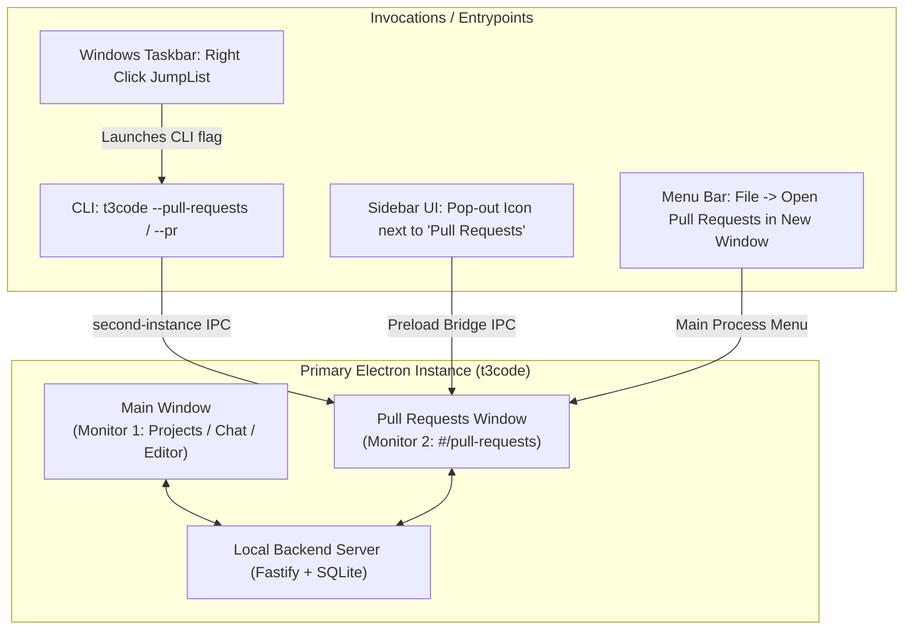

# Multi-Window Pull Requests Postplan & Guide

## 1. Overview & Architecture

The multi-window Pull Requests feature enables a dual-monitor workflow in T3 Code. You can keep your primary development workspace (Projects, Editor, Active Chat, Timeline) open on your primary display while maintaining a dedicated, persistent **Pull Requests** window on your secondary display.



### Shared State & Session

- **Unified Backend**: Both the main window and the Pull Requests window communicate with the same local Fastify server process and SQLite database.
- **Shared Partition**: Electron partition session (`persist:t3code-dev` or `persist:t3code`) is shared, meaning authentication (Clerk tokens, local pairing credentials) is seamless.
- **Independent Layout & Bounds**: Window position, size, and maximized state for the Pull Requests window are tracked separately (`pullRequestsWindowBounds` & `pullRequestsWindowMaximized`) in settings and flushed cleanly on exit.

---

## 2. The 4 Ways to Open the Pull Requests Window

### 1. In-App Sidebar Pop-Out Button (Fastest in UI)

1. Open T3 Code.
2. Look at the left sidebar utility menu.
3. Hover over the **Pull Requests** item.
4. Click the **Pop-out window icon** (`ExternalLinkIcon`) next to the text.
5. The dedicated window opens or gains focus if already open.

### 2. Windows Taskbar JumpList

1. Right-click the **T3 Code** icon in your Windows Taskbar.
2. Under **Tasks**, select **Pull Requests**.
3. If T3 Code is already open, it activates the secondary instance handler and pops up the Pull Requests window without disrupting your main window.
4. If T3 Code is closed, it launches T3 Code with the `--pull-requests` flag, auto-opening the PR window as soon as the backend is ready.

### 3. Application Menu Bar

- Navigate to **File** > **Open Pull Requests in New Window**.
- Available on Windows, macOS, and Linux native menus.

### 4. Command Line / Terminal

You can invoke it directly from PowerShell, Windows Terminal, or your shell:

```powershell
t3code --pull-requests
# Or using the shorthand alias:
t3code --pr
```

- If T3 Code is already running, Electron's single-instance lock intercepts the command, sends the `--pull-requests` parameter to the running instance, focuses/reveals the PR window, and immediately exits the secondary process.

---

## 3. Multi-Monitor Placement Behavior

When opening the Pull Requests window for the first time without saved bounds:

1. **Dual / Multi-Monitor**: T3 Code checks all connected displays (`electron.screen.getAllDisplays()`). It positions and centers the Pull Requests window onto **Monitor 2** (`displays[1]`).
2. **Single Monitor**: If only one monitor is connected, it centers the window cleanly on the current display.
3. **Subsequent Launches**: Any repositioning, resizing, or maximizing is automatically saved and debounced to settings (`pullRequestsWindowBounds`). It remembers where you placed it across app restarts.

---

## 4. Technical Implementation Reference

- **IPC Bridge**: [`packages/contracts/src/ipc.ts`](file:///z:/Workspaces/t3code/packages/contracts/src/ipc.ts#L1133) (`openPullRequestsWindow`)
- **Preload Hook**: [`apps/desktop/src/preload.ts`](file:///z:/Workspaces/t3code/apps/desktop/src/preload.ts#L119)
- **Window Controller**: [`apps/desktop/src/window/DesktopWindow.ts`](file:///z:/Workspaces/t3code/apps/desktop/src/window/DesktopWindow.ts) (`openPullRequests`, `createPullRequestsWindow`)
- **Settings Store**: [`apps/desktop/src/settings/DesktopAppSettings.ts`](file:///z:/Workspaces/t3code/apps/desktop/src/settings/DesktopAppSettings.ts) (`pullRequestsWindowBounds`)
- **Single-Instance Forwarding**: [`apps/desktop/src/app/DesktopClerk.ts`](file:///z:/Workspaces/t3code/apps/desktop/src/app/DesktopClerk.ts#L143)
- **Windows Taskbar Registration**: [`apps/desktop/src/app/DesktopAppIdentity.ts`](file:///z:/Workspaces/t3code/apps/desktop/src/app/DesktopAppIdentity.ts#L142)
- **Sidebar Button**: [`apps/web/src/components/sidebar/SidebarChrome.tsx`](file:///z:/Workspaces/t3code/apps/web/src/components/sidebar/SidebarChrome.tsx#L210)
- **Menu Bar**: [`apps/desktop/src/window/DesktopApplicationMenu.ts`](file:///z:/Workspaces/t3code/apps/desktop/src/window/DesktopApplicationMenu.ts#L170)
