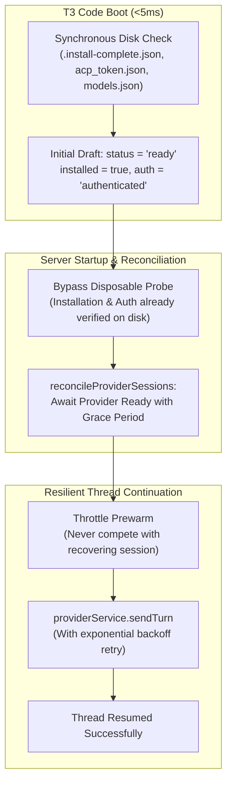

# AGCP (Antigravity ACP) Fast Startup & Resilient Restart Plan

- **Published Postplan**: [https://2jm1kkcwwx4b.postplan.dev](https://2jm1kkcwwx4b.postplan.dev)
- **Local Spec File**: [`docs/plans/agcp-fast-startup-session-continuation.html`](file:///z:/Workspaces/t3code/docs/plans/agcp-fast-startup-session-continuation.html)
- **Status**: Proposed / Ready for Implementation

---

## 1. Problem Statement & Root Cause

Migrating from the lightweight CLI (`agy.exe`, <50ms `--version`) to the Agent Client Protocol server (`agy_acp_server.exe`, 297MB PyInstaller one-file binary + 122MB localharness) introduced two severe regressions:

1. **40-Second Cold Boot Delay**:
   - `AntigravityDriver.probe` cold-spawns a throwaway `agy_acp_server.exe` instance on startup just to execute `runtime.initialize()`, then immediately destroys it (`Scope.close(processScope, Exit.void)`).
   - `makeAntigravityProvider` emits an `initialDraft` with `status: "warning"` and `installed: false` even when the binary, `acp_token.json`, and `models.json` exist on disk, locking the UI in a "Checking Antigravity availability" state for 40 seconds.
   - `prepareAntigravityProfile` spawns a redundant helper node test-process on every runtime launch.
2. **Immediate Running Thread Failures on Restart**:
   - `serverRuntimeStartup.ts` (`reconcileProviderSessions`) executes immediately during server boot without waiting for provider readiness.
   - As a result, 3 concurrent PyInstaller processes are launched simultaneously: the health probe, the recovering thread's session, and the standby prewarm.
   - If any timeout or connection contention occurs, `reconcileProviderSessions` catches it and immediately executes `settleAsError("Could not continue this thread after the server restart. Send a new message to continue.")`, destroying the active turn.

---

## 2. Solution Architecture

### Key Phases:

1. **Phase 1: Instant Optimistic Provider Readiness (<5ms)**:
   - Check `installation.resolve()`, `acp_token.json`, and `models.json` synchronously.
   - Seed `initialDraft` directly as `ready` and `authenticated`.
2. **Phase 2: Eliminate Disposable Startup Probe**:
   - If binary and auth token exist, return immediate probe success using disk metadata without cold-spawning a disposable 300MB PyInstaller server.
   - Cache browser suppression preflight per process lifetime.
3. **Phase 3: Prewarm Throttling**:
   - Do not spawn background `prewarm` during session recovery.
4. **Phase 4: Provider Readiness Gating & Retry in `reconcileProviderSessions`**:
   - Await provider readiness before calling `sendTurn`.
   - Add exponential backoff retry (2s, 4s, 8s) for continuation turns.
   - Preserve thread state gracefully if unexpected failures occur.

---

## 3. Implementation Target Files

- [`apps/server/src/provider/Layers/AntigravityProvider.ts`](file:///z:/Workspaces/t3code/apps/server/src/provider/Layers/AntigravityProvider.ts)
- [`apps/server/src/provider/Drivers/AntigravityDriver.ts`](file:///z:/Workspaces/t3code/apps/server/src/provider/Drivers/AntigravityDriver.ts)
- [`apps/server/src/provider/Layers/AntigravityAdapter.ts`](file:///z:/Workspaces/t3code/apps/server/src/provider/Layers/AntigravityAdapter.ts)
- [`apps/server/src/serverRuntimeStartup.ts`](file:///z:/Workspaces/t3code/apps/server/src/serverRuntimeStartup.ts)
- [`apps/server/src/provider/antigravityAuthSupport.ts`](file:///z:/Workspaces/t3code/apps/server/src/provider/antigravityAuthSupport.ts)
