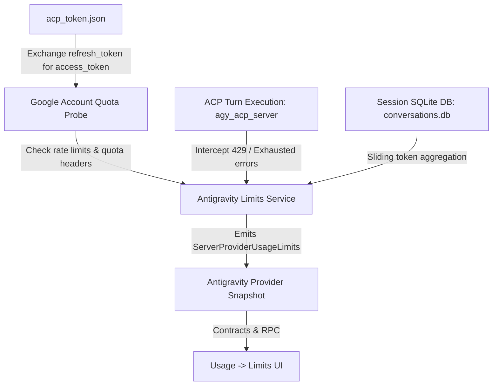

# Native Antigravity Limits Tracking: Architecture & Implementation Plan

## 1. Context & Problem Statement

In T3 Code, the **Usage → Limits** tab gives users a real-time view of their AI subscription quota windows (e.g., session allowances, weekly limits, reset countdowns, and pace markers).

Currently, this only works for **Codex** and **Claude Code**:

- **Codex**: Exposes quota RPCs (`account/rateLimits/read`) and notifications (`account/rateLimits/updated`).
- **Claude Code**: Exposes `get_usage` and streams `rate_limit_event` SSE events.
- **Antigravity**: Interacts via Google's Agent Client Protocol (ACP) harness (`agy_acp_server.par`). In [`AntigravityProvider.ts`](file:///z:/Workspaces/t3code/apps/server/src/provider/Layers/AntigravityProvider.ts), `usageLimits` is never populated. Because `provider.usageLimits` is undefined, [`providersWithLimits`](file:///z:/Workspaces/t3code/packages/shared/src/usageLimits.ts) filters Antigravity out completely. The UI therefore displays no bars or reports that no provider supports limits.

_(Note: "CLIProxyAPI" mentioned previously is an external proxy tool for pooling accounts in team environments; it does not apply to your native Google sign-in)._

---

## 2. Technical Feasibility: How Native Antigravity Quota Tracking Works

When you authenticate with Antigravity in T3 Code, credentials are saved locally in:
`%USERPROFILE%\.t3\userdata\providers\antigravity\<hash>\antigravity-acp\acp_token.json`

This file contains:

- `refresh_token`
- `client_id` & `client_secret`
- OAuth scopes: `https://www.googleapis.com/auth/aicode`, `cloud-platform`, `userinfo.email`
- `project_id`: `"aicode-consumers"`

Google enforces usage quotas per Google account tier (e.g. standard limits, Gemini Advanced / Google One AI Premium tier, or Cloud Project quota). To track and display these limits in T3 Code, we combine three mechanisms:

### Approach 1: Background Status Probe (Google Quota / User Status)

- Using the stored `refresh_token`, exchange for an access token against `https://oauth2.googleapis.com/token`.
- Make a lightweight probe request to Google's backend endpoint (or inspect quota response headers such as remaining quota and reset intervals).
- Yield standard `ServerProviderUsageLimits` with window durations (e.g. 5-hour rolling session or daily allowance).

### Approach 2: Turn-Driven Event Interception (Rate Limit Detection)

- When a prompt or turn in [`AntigravityAdapter.ts`](file:///z:/Workspaces/t3code/apps/server/src/provider/Layers/AntigravityAdapter.ts) fails due to rate limits or quota exhaustion (HTTP 429 or `RESOURCE_EXHAUSTED` / `QUOTA_EXCEEDED`):
  - Extract the reset time from the error details (e.g., "try again in X seconds/minutes").
  - Dispatch a `ProviderUsageLimitsUpdate` with `usedPercent: 100` and the calculated `resetsAt` ISO timestamp.
  - The Limits UI instantly reflects the quota exhaustion and displays the countdown to reset.

### Approach 3: Local Rolling-Window Token Estimator

- [`AntigravityAdapter.ts`](file:///z:/Workspaces/t3code/apps/server/src/provider/Layers/AntigravityAdapter.ts#L384) already inspects `conversations/<id>.db` to track token counts (`syncTokenTrackerFromDb`).
- Local turns within the current rolling window (e.g. 5 hours) can be aggregated against known tier capacity to provide real-time pace indicators (Ahead, On Pace, Under Pace).

---

## 3. Implementation Plan (Postplan)

### Step 1: Server Quota Layer (`apps/server/src/provider/Layers/antigravityUsageLimits.ts`)

- Implement `probeAntigravityUsageLimits`:
  - Read `acp_token.json`.
  - Refresh access token if expired.
  - Query Google's quota / status endpoint or compute rolling window status.
  - Return `ServerProviderUsageLimits` containing `windows` (e.g., `kind: "session"`, `label: "Session"`, `usedPercent`, `resetsAt`).
- Implement error mapper for turn-level quota exceptions (extracting duration until reset).

### Step 2: Hook Provider Snapshot & Updates

- In [`AntigravityProvider.ts`](file:///z:/Workspaces/t3code/apps/server/src/provider/Layers/AntigravityProvider.ts):
  - Add `usageLimits` field to the initial provider draft.
  - In `checkProvider`, call `probeAntigravityUsageLimits` alongside existing health checks.
- In [`AntigravityAdapter.ts`](file:///z:/Workspaces/t3code/apps/server/src/provider/Layers/AntigravityAdapter.ts):
  - Forward quota error events via `applyUsageLimitsUpdate`.

### Step 3: Frontend Presentation & Color Mapping

- In [`apps/web/src/components/usage/UsageLimits.tsx`](file:///z:/Workspaces/t3code/apps/web/src/components/usage/UsageLimits.tsx#L55):
  - Update `barColor` to include `driver === "antigravity"` returning `#4285f4` (`PROVIDER_PRESENTATION.antigravity.color`).
- In [`apps/mobile/src/features/usage/UsageLimitsSection.tsx`](file:///z:/Workspaces/t3code/apps/mobile/src/features/usage/UsageLimitsSection.tsx#L40):
  - Update `useBarColor` and `DRIVER_LABEL` to include Antigravity.

---

## 4. Verification & Testing

1. **Mock Quota Probe Unit Tests**:
   - Verify token refresh and window mapping in `antigravityUsageLimits.test.ts`.
2. **Turn Error Injection Test**:
   - Simulate a 429 quota exhaustion error during an ACP session prompt and assert the published provider state updates `usedPercent: 100` and `resetsAt`.
3. **UI Verification**:
   - Open **Usage → Limits** in the web client and ensure the Antigravity card renders with Google account details, progress bars, and pace metrics.
